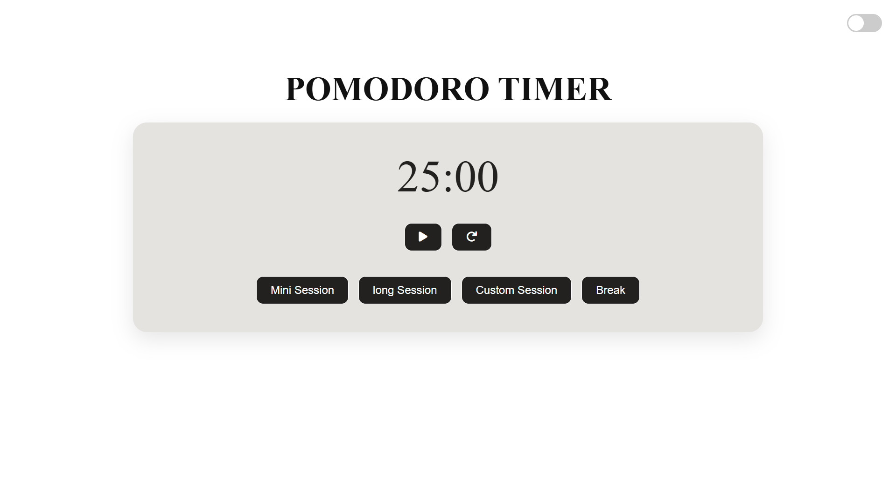
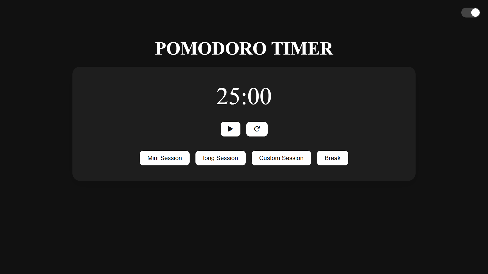
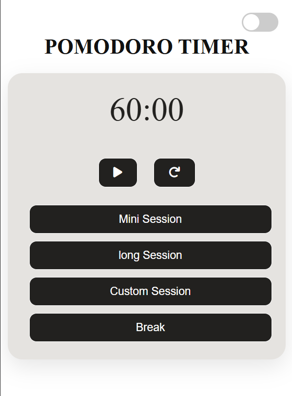
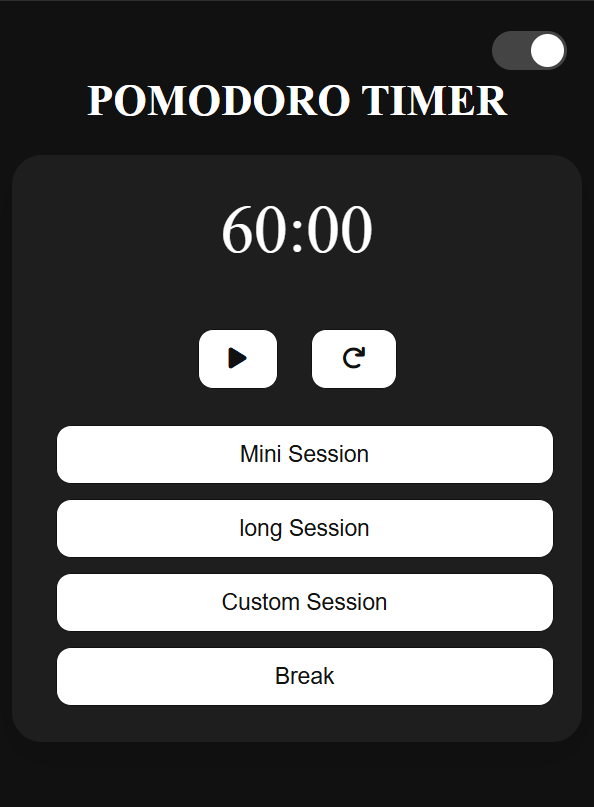
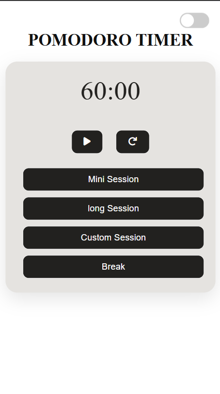
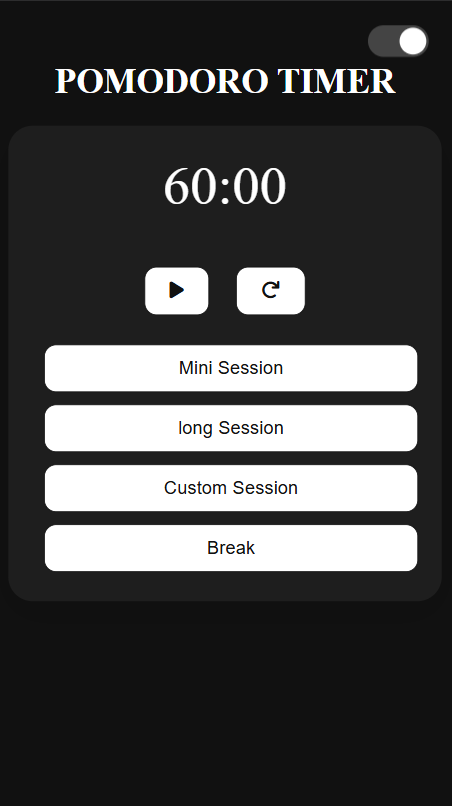

# Pmodoro Timer

A mini web app to track time using pomodoro technique

- Link to the project
  [View project](https://pomodoro-timer-ten-xi.vercel.app/)

## Tech stack used to implement the web app

- HTML
- CSS
- JavaScript

## Features

- Mini Session - 25 minutes session
- Long Session - 1 hour session
- Custom session - user can customize the session duration between 1 minute and 1 hour
- Break - 10 minutes
- User can pause and reset the session whenever he/she wished

- The UI is responsive

# responsive UI designs

### Desktop view

  
  

### Tablet view

  
  

### Mobile view

  
  
